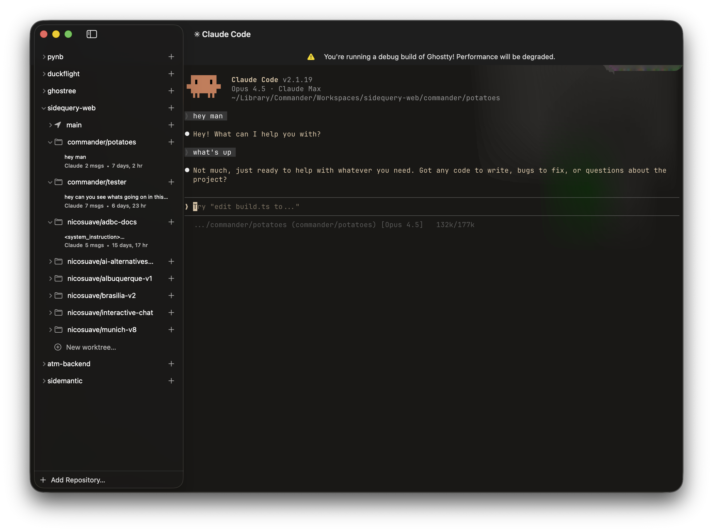

<!-- LOGO -->
<h1>
<p align="center">
  
  <br>Ghostree
</h1>
  <p align="center">
    A fork of a fast, native, feature-rich terminal emulator pushing modern features with <a href="https://worktrunk.dev/" target="_blank">worktrunk</a> built-in.
    <br /><br />
    macOS: <code>brew install sidequery/tap/ghostree</code>
    <br /><br />
    <a href="#about">About</a>
    ·
    <a href="https://ghostty.org/download">Download</a>
    ·
    <a href="https://ghostty.org/docs">Documentation</a>
    ·
    <a href="CONTRIBUTING.md">Contributing</a>
    ·
    <a href="HACKING.md">Developing</a>
  </p>
</p>

<p align="center">
  
</p>

## About

Ghostty is a terminal emulator that differentiates itself by being
fast, feature-rich, and native. While there are many excellent terminal
emulators available, they all force you to choose between speed,
features, or native UIs. Ghostty provides all three.

In all categories, I am not trying to claim that Ghostty is the
best (i.e. the fastest, most feature-rich, or most native). But
Ghostty is competitive in all three categories and Ghostty
doesn't make you choose between them.

Ghostty also intends to push the boundaries of what is possible with a
terminal emulator by exposing modern, opt-in features that enable CLI tool
developers to build more feature rich, interactive applications.

While aiming for this ambitious goal, our first step is to make Ghostty
one of the best fully standards compliant terminal emulator, remaining
compatible with all existing shells and software while supporting all of
the latest terminal innovations in the ecosystem. You can use Ghostty
as a drop-in replacement for your existing terminal emulator.

For more details, see [About Ghostty](https://ghostty.org/docs/about).

## Download

See the [download page](https://ghostty.org/download) on the Ghostty website.

## Documentation

See the [documentation](https://ghostty.org/docs) on the Ghostty website.

## Contributing and Developing

If you have any ideas, issues, etc. regarding Ghostty, or would like to
contribute to Ghostty through pull requests, please check out our
["Contributing to Ghostty"](CONTRIBUTING.md) document. Those who would like
to get involved with Ghostty's development as well should also read the
["Developing Ghostty"](HACKING.md) document for more technical details.

## Roadmap and Status

The high-level ambitious plan for the project, in order:

|  #  | Step                                                      | Status |
| :-: | --------------------------------------------------------- | :----: |
|  1  | Standards-compliant terminal emulation                    |   ✅   |
|  2  | Competitive performance                                   |   ✅   |
|  3  | Basic customizability -- fonts, bg colors, etc.           |   ✅   |
|  4  | Richer windowing features -- multi-window, tabbing, panes |   ✅   |
|  5  | Native Platform Experiences (i.e. Mac Preference Panel)   |   ⚠️   |
|  6  | Cross-platform `libghostty` for Embeddable Terminals      |   ⚠️   |
|  7  | Windows Terminals (including PowerShell, Cmd, WSL)        |   ❌   |
|  N  | Fancy features (to be expanded upon later)                |   ❌   |

Additional details for each step in the big roadmap below:

#### Standards-Compliant Terminal Emulation

Ghostty implements enough control sequences to be used by hundreds of
testers daily for over the past year. Further, we've done a
[comprehensive xterm audit](https://github.com/ghostty-org/ghostty/issues/632)
comparing Ghostty's behavior to xterm and building a set of conformance
test cases.

We believe Ghostty is one of the most compliant terminal emulators available.

Terminal behavior is partially a de jure standard
(i.e. [ECMA-48](https://ecma-international.org/publications-and-standards/standards/ecma-48/))
but mostly a de facto standard as defined by popular terminal emulators
worldwide. Ghostty takes the approach that our behavior is defined by
(1) standards, if available, (2) xterm, if the feature exists, (3)
other popular terminals, in that order. This defines what the Ghostty project
views as a "standard."

#### Competitive Performance

We need better benchmarks to continuously verify this, but Ghostty is
generally in the same performance category as the other highest performing
terminal emulators.

For rendering, we have a multi-renderer architecture that uses OpenGL on
Linux and Metal on macOS. As far as I'm aware, we're the only terminal
emulator other than iTerm that uses Metal directly. And we're the only
terminal emulator that has a Metal renderer that supports ligatures (iTerm
uses a CPU renderer if ligatures are enabled). We can maintain around 60fps
under heavy load and much more generally -- though the terminal is
usually rendering much lower due to little screen changes.

For IO, we have a dedicated IO thread that maintains very little jitter
under heavy IO load (i.e. `cat <big file>.txt`). On benchmarks for IO,
we're usually within a small margin of other fast terminal emulators.
For example, reading a dump of plain text is 4x faster compared to iTerm and
Kitty, and 2x faster than Terminal.app. Alacritty is very fast but we're still
around the same speed (give or take) and our app experience is much more
feature rich.

> [!NOTE]
> Despite being _very fast_, there is a lot of room for improvement here.

#### Richer Windowing Features

The Mac and Linux (build with GTK) apps support multi-window, tabbing, and
splits.

#### Native Platform Experiences

Ghostty is a cross-platform terminal emulator but we don't aim for a
least-common-denominator experience. There is a large, shared core written
in Zig but we do a lot of platform-native things:

- The macOS app is a true SwiftUI-based application with all the things you
  would expect such as real windowing, menu bars, a settings GUI, etc.
- macOS uses a true Metal renderer with CoreText for font discovery.
- The Linux app is built with GTK.

There are more improvements to be made. The macOS settings window is still
a work-in-progress. Similar improvements will follow with Linux.

#### Cross-platform `libghostty` for Embeddable Terminals

In addition to being a standalone terminal emulator, Ghostty is a
C-compatible library for embedding a fast, feature-rich terminal emulator
in any 3rd party project. This library is called `libghostty`.

Due to the scope of this project, we're breaking libghostty down into
separate actually libraries, starting with `libghostty-vt`. The goal of
this project is to focus on parsing terminal sequences and maintaining
terminal state. This is covered in more detail in this
[blog post](https://mitchellh.com/writing/libghostty-is-coming).

`libghostty-vt` is already available and usable today for Zig and C and
is compatible for macOS, Linux, Windows, and WebAssembly. At the time of
writing this, the API isn't stable yet and we haven't tagged an official
release, but the core logic is well proven (since Ghostty uses it) and
we're working hard on it now.

The ultimate goal is not hypothetical! The macOS app is a `libghostty` consumer.
The macOS app is a native Swift app developed in Xcode and `main()` is
within Swift. The Swift app links to `libghostty` and uses the C API to
render terminals.

## Crash Reports

Ghostty has a built-in crash reporter that will generate and save crash
reports to disk. The crash reports are saved to the `$XDG_STATE_HOME/ghostty/crash`
directory. If `$XDG_STATE_HOME` is not set, the default is `~/.local/state`.
**Crash reports are _not_ automatically sent anywhere off your machine.**

Crash reports are only generated the next time Ghostty is started after a
crash. If Ghostty crashes and you want to generate a crash report, you must
restart Ghostty at least once. You should see a message in the log that a
crash report was generated.

> [!NOTE]
>
> Use the `ghostty +crash-report` CLI command to get a list of available crash
> reports. A future version of Ghostty will make the contents of the crash
> reports more easily viewable through the CLI and GUI.

Crash reports end in the `.ghosttycrash` extension. The crash reports are in
[Sentry envelope format](https://develop.sentry.dev/sdk/envelopes/). You can
upload these to your own Sentry account to view their contents, but the format
is also publicly documented so any other available tools can also be used.
The `ghostty +crash-report` CLI command can be used to list any crash reports.
A future version of Ghostty will show you the contents of the crash report
directly in the terminal.

To send the crash report to the Ghostty project, you can use the following
CLI command using the [Sentry CLI](https://docs.sentry.io/cli/installation/):

```shell-session
SENTRY_DSN=https://e914ee84fd895c4fe324afa3e53dac76@o4507352570920960.ingest.us.sentry.io/4507850923638784 sentry-cli send-envelope --raw <path to ghostty crash>
```

> [!WARNING]
>
> The crash report can contain sensitive information. The report doesn't
> purposely contain sensitive information, but it does contain the full
> stack memory of each thread at the time of the crash. This information
> is used to rebuild the stack trace but can also contain sensitive data
> depending on when the crash occurred.
